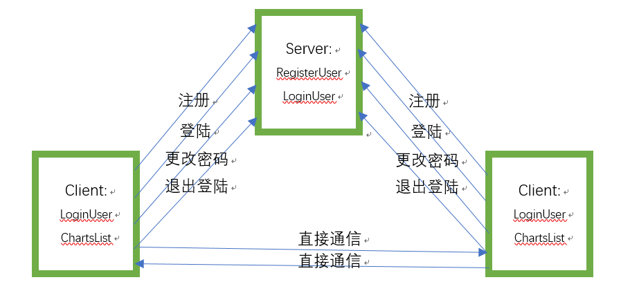

# gChat: An open source instant messaging script based on UDP

### Feature
- Duplicate login and registration avoidance
- Change passward
- P2P connection
- Snapshot save and replay
- Message caching and dilivering
- Support both command-line mode (client.py) and UI mode (window.py)

### Architecture
- Server: maintain the registered and login users, and shared the login users' IP for the P2P chat. The server does not capture or save the chat histories. If one user sends a message to others who have not logged in, the message will be delivered to the server and server transmit to the user when it login. 
- Client: register and log in to the server, and request the currently logged in user IP from the server. Direct P2P chat connection created according to the login user IP. All chat will be saved to the client.


### Start
##### Server:
```
python server.py
```

##### Client:
```
python client.py
```
or 
```
python window.py
```
